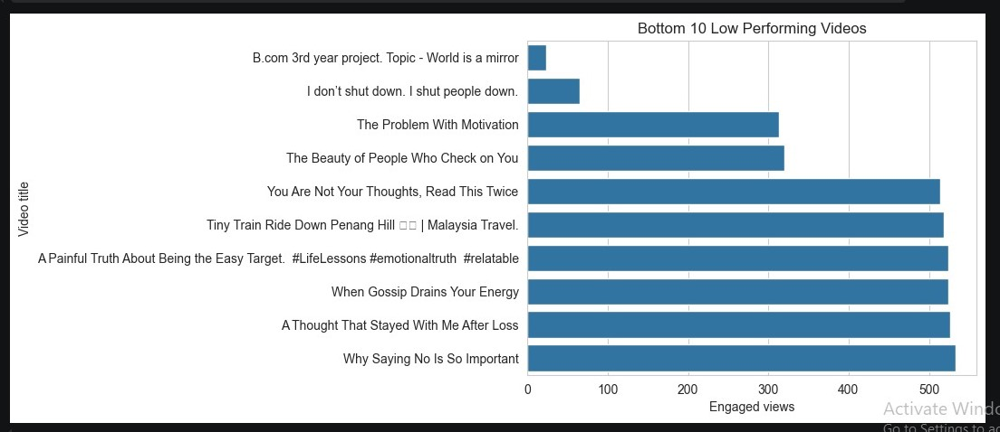
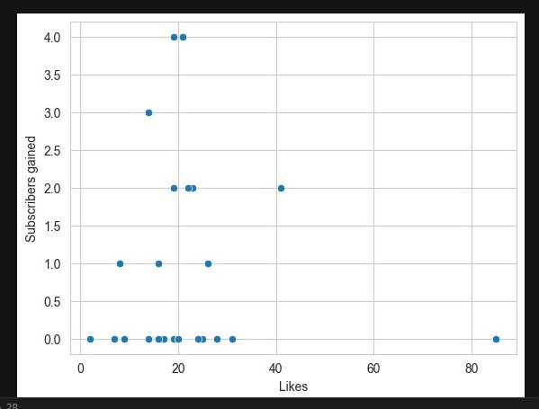
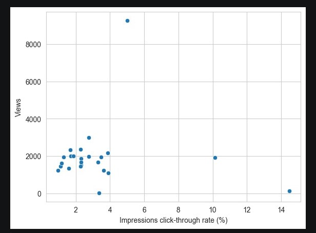
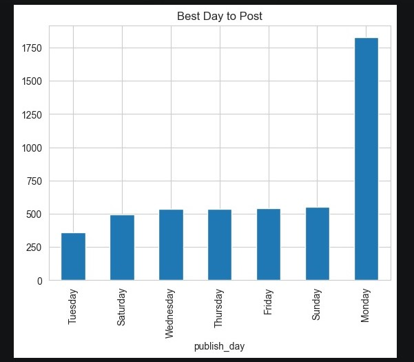

# YouTube Shorts EDA (Python)

## Project Objective

Analyze YouTube Shorts performance to identify key factors influencing engagement, retention, and subscriber conversion.

## Dataset

* Source: Personal YouTube Analytics (March 2026)
* Size: 24 videos
* Features: Views, Likes, Comments, Shares, CTR, Watch Time, Subscribers gained/lost

## Tools Used

* Python (Pandas, NumPy)
* Matplotlib, Seaborn
* Jupyter Notebook
  
## Key Analysis Performed

* Data Cleaning & Preprocessing
* Engagement Analysis
* Conversion Rate Analysis
* CTR vs Views Analysis
* Best Posting Day Analysis

## Visual Insights

### Top Performing Videos

### Low Performing Videos

### Likes vs Subscribers

### CTR vs Views

### Best Day to Post

## Key Insights

* Emotional and relatable content drives higher engagement
* High views do not always convert into subscribers
* Several videos showed zero conversion → lack of strong call-to-action
* Posting day impacts performance (Monday performed best)

## Business Impact

* Identified gap between reach and conversion
* Suggested content strategy focused on emotional relatability
* Highlighted importance of engagement quality over impressions
* Recommended optimizing posting timing
  
## Limitations

* Dataset limited to one month (24 videos)
* External factors like algorithm changes not considered
* Content categories not explicitly labeled

## Conclusion

* YouTube Shorts growth is driven more by audience connection and retention rather than just views. 
* Optimizing content strategy and conversion funnel can significantly improve channel growth.

